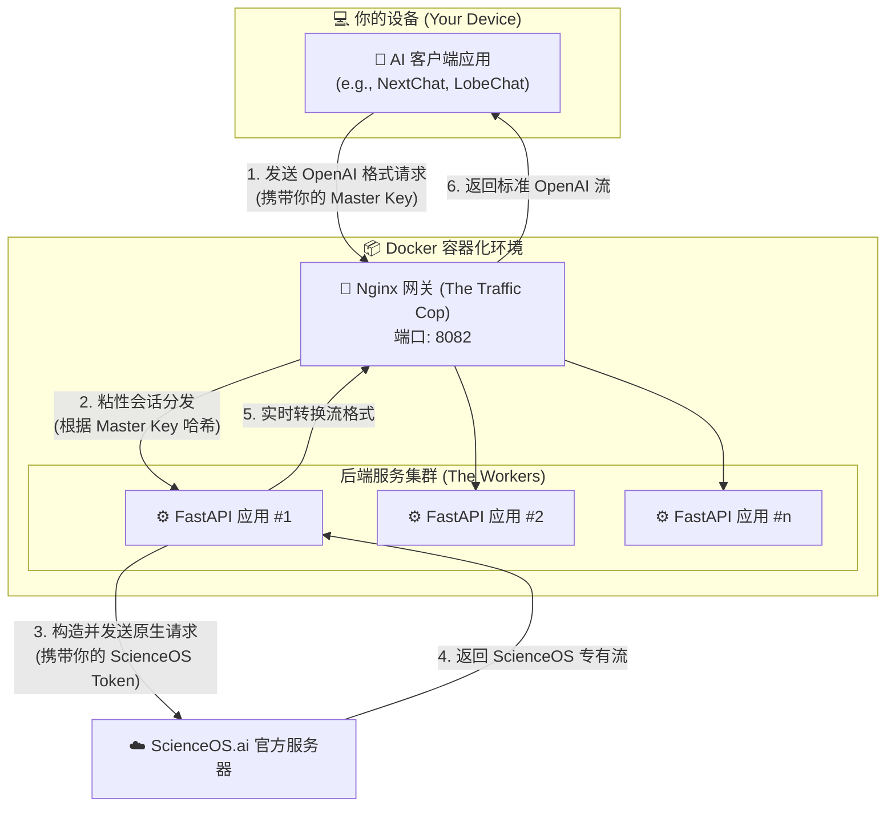

# ScienceOS-2API (v1.2.1) 🔬✨ - 将科研AI带入寻常百姓家

> ### **一份宣言 📜: “我思，故我在。我开源，故我们存。”**
>
> 在数字的洪流中，我们不应只是被动的信息消费者，更应成为主动的知识创造者。本项目存在的意义，不仅是破解一个应用的壁垒，更是传递一种信念：**最前沿的工具，应当服务于最广泛的智慧。**
>
> 我们将 `ScienceOS` 这座象牙塔中的科研利器，带到每一位开发者、学生、乃至充满好奇心的“你”的面前。通过将其封装为开放、标准的 API，我们希望点燃的，是您心中那团探索未知、动手创造的火焰。
>
> 这不是一个终点，而是一个起点。一个让每个人都能站在巨人肩膀上，看得更远、走得更快的起点。**加入我们，让知识的流动，如代码般自由。**

---

## 🚀 项目速览 (TL;DR)

**ScienceOS-2API** 是一个高性能、生产级的本地代理服务。它能将 ScienceOS 官网 [<sup>1</sup>](https://app.scienceos.ai/) 强大的科研对话能力，通过精密的逆向工程，完美封装成与 **OpenAI API 完全兼容**的接口。

这意味着，您可以在**不修改一行代码**的情况下，将您喜爱的任何AI应用（如 NextChat, LobeChat, AMOS 等）无缝对接到 ScienceOS，让顶级的科研AI为您所用。

### ✨ 核心特性

-   **🌍 通用兼容性 (Universal Compatibility)**: 100% 兼容 OpenAI API 格式，即插即用。
-   **🛡️ 企业级架构 (Enterprise-Grade Architecture)**: 内置 Nginx 实现“粘性会话”，即使在多核CPU上部署多个服务副本，也能确保流式对话的绝对稳定，告别乱序和中断。
-   **⚡️ 极致性能 (Extreme Performance)**: 基于 `FastAPI` + `Uvicorn` + `HTTPX` 的全异步架构，为高并发和低延迟而生。
-   **📦 一键化部署 (One-Click Deployment)**: 提供终极简化的 `docker-compose.yml`，真正实现“一键启动，永久运行”。
-   **🧠 智能流式转换 (Intelligent Stream-Translation)**: 核心 `provider` 模块能够实时、精准地将 ScienceOS 的专有流式协议，转换为标准的 OpenAI SSE (Server-Sent Events) 格式。
-   **🔑 安全可靠 (Secure & Reliable)**: 支持 `API_MASTER_KEY` 认证，保护您的服务不被未授权访问。

---

## 🗺️ 一份蓝图: 架构与数据流全景解析

理解一个系统如何工作，是掌握它的第一步。本项目采用经典且极其高效的**反向代理架构**，每一个组件都各司其职，共同构成了这个稳定而强大的服务。



### 🔍 数据流转的“大白话”解释

想象一下你去一家高级餐厅（`ScienceOS.ai`）吃饭，但你只会说“普通话”（OpenAI API），而餐厅服务员只懂“行话”（ScienceOS 原生API）。

1.  **你的点餐 (步骤 1)**: 你（`客户端应用`）走到餐厅门口的领位员（`Nginx 网关`）面前，用“普通话”说出你的菜单，并出示你的会员卡（`API_MASTER_KEY`）。

2.  **领位员的智慧 (步骤 2)**: 领位员非常聪明，他认得你的会员卡。为了让你每次都能享受到同样质量的服务，他会把你**固定**分配给一位专属服务员（`FastAPI 应用 #1`）。这就是**“粘性会话”**，确保你的“上汤”和“主菜”不会被不同服务员搞混。

3.  **服务员的翻译 (步骤 3)**: 你的专属服务员拿到你的“普通话”菜单后，立刻在厨房门口用“行话”向厨师（`ScienceOS 服务器`）下单，并出示了餐厅的内部通行证（`SCIENCEOS_AUTH_TOKEN`）。

4.  **厨房出菜 (步骤 4 & 5)**: 厨房开始一道一道地出菜（`流式响应`），但菜品摆盘是餐厅内部风格。你的专属服务员在把菜端给你之前，会**实时地**将每一道菜重新摆盘，变成你熟悉的“家常风格”（`OpenAI SSE 格式`）。

5.  **享受大餐 (步骤 6)**: 你顺利地、一道接一道地享用着你的“家常菜”，完全不知道背后发生了这么多复杂的翻译和转换工作。

---

## 🔬 一份深度报告: 原理、优劣与未来

### 🎯 项目价值与应用场景

**这个项目带来了什么？**

-   **赋能 (Empowerment)**: 它将一个原本封闭、专业的科研工具，变成了一个任何人都可以通过标准接口调用的“AI能力积木”。你可以用它来构建自己的论文助手、代码分析器、或者任何需要严谨科学知识的应用。
-   **降本增效 (Cost & Efficiency)**: 对于已经拥有 ScienceOS 账户的用户，这意味着可以利用其免费或已付费的额度，驱动整个 OpenAI 应用生态，极大地节省了调用商业 API 的成本。
-   **学习与探索 (Learning & Exploration)**: 本项目本身就是一个绝佳的学习案例，展示了如何通过网络分析、逆向工程和软件架构，将一个 Web 应用转化为一个强大的 API 服务。

**它能用在什么地方？**

-   **学术研究**: 学生和研究员可以将其接入 Zotero、Obsidian 等笔记软件，实现与文献的深度对话。
-   **软件开发**: 程序员可以构建 VSCode 插件，让 ScienceOS 帮助分析代码、解释算法、甚至生成测试用例。
-   **个人知识库**: 将其接入任何支持 OpenAI API 的个人助理或聊天客户端，打造一个超级智能的、以科学知识为核心的对话伙伴。

### 🤔 优劣势分析 (Pros & Cons)

| 优点 (Pros) 👍                                               | 缺点 (Cons) 👎                                               |
| ------------------------------------------------------------ | ------------------------------------------------------------ |
| **零成本/低成本接入**：利用现有账户，无需额外API费用。       | **依赖官方服务**：如果 ScienceOS 官网更新或改变API，本项目可能需要同步更新。 |
| **完全控制与隐私**：所有请求通过你自己的服务器中转，数据更安全。 | **需要动手能力**：需要用户具备基本的 Docker 使用知识。       |
| **高性能与高并发**：企业级架构，可轻松应对大量请求。         | **认证信息有有效期**：`SCIENCEOS_AUTH_TOKEN` 可能会过期，需要定期手动更新。 |
| **无限扩展性**：可以轻松集成到任何现有或未来的AI应用中。     | **功能局限**：目前仅支持文本对话，不支持官方可能存在的其他功能（如图表生成）。 |

### 🛠️ 核心技术揭秘

#### 1. Nginx 粘性会话 (Sticky Sessions) - `★★☆☆☆` 简单但关键

-   **技术点**: `nginx.conf` 中的 `hash $http_authorization consistent;`
-   **专业解释**: 这是一个基于哈希的负载均衡策略。Nginx 会获取 HTTP 请求头中的 `Authorization` 字段（也就是你的 `API_MASTER_KEY`），计算一个哈希值，然后根据这个值来决定将请求发送到哪个后端的 FastAPI Worker。`consistent` 关键字确保了当后端 Worker 数量变化时，只有极少数的哈希映射会改变，最大程度地保持了会话"粘性"。
-   **大白话**: 就像超市的收银台，Nginx（商场经理）会给每个持有特定会员卡（`API_MASTER_KEY`）的顾客，都**固定**安排同一个收银员（FastAPI Worker）。这样，即使你分多次结账，也总是在同一个窗口，避免了混乱。
-   **灵感来源**: 这个方法是解决无状态服务处理有状态流（如SSE）时最经典、最可靠的方案之一，在大量的高并发实践中被反复验证。你可以在任何关于 Nginx 负载均衡的官方文档或深度博客（如 Google 搜索 "nginx sticky session sse"）中找到类似思路。

#### 2. FastAPI 异步处理与 Provider 模式 - `★★★☆☆` 现代Web开发的基石

-   **技术点**: `main.py` 中的 `async def`, `app/providers/scienceos_provider.py`
-   **专业解释**: FastAPI 是一个基于 Python 3.7+ 类型提示的现代高性能 Web 框架。它天生支持**异步**，意味着在等待网络响应（例如，等待 ScienceOS 服务器返回数据）时，服务可以去处理其他请求，而不是傻等。这极大地提高了并发处理能力。**Provider 模式**是一种软件设计模式，我们将所有与特定第三方服务（ScienceOS）打交道的脏活累活，都封装在一个独立的 `ScienceOSProvider` 类中。这使得主应用 `main.py` 保持干净、整洁，并且未来如果想支持新的服务（比如 `AnotherAI-2API`），我们只需要新增一个 `AnotherAIProvider` 即可，互不干扰。
-   **大白话**: 你的服务员（FastAPI）是个时间管理大师。他在等厨房出菜的间隙，会去给其他客人点餐，而不是在原地发呆。Provider 模式就像你把所有关于“中餐”、“西餐”、“日料”的知识，分别整理在不同的笔记本里，需要做哪种菜，就翻开对应的笔记本，条理清晰。
-   **灵感来源**: 这是现代 Python Web 开发的最佳实践。FastAPI 的官方文档是学习异步和依赖注入的绝佳起点。Provider（或称 Service Layer）模式是领域驱动设计（DDD）中的一个核心概念，旨在分离业务逻辑和框架代码。

#### 3. 智能流式转换 (SSE Translator) - `★★★★☆` 本项目的灵魂

-   **技术点**: `scienceos_provider.py` 中的 `_stream_generator` 函数
-   **专业解释**: 这是本项目的核心算法。它通过 `httpx.AsyncClient` 以流式方式从 ScienceOS 服务器接收数据。然后，它逐行 (`aiter_lines`) 读取这些 `data:` 开头的 SSE 事件。最关键的一步是，它能**识别并解析**两种不同结构的 `data`：一种是包含 JSON 编码字符串的纯文本内容，另一种是包含元数据（如 `followups`）的 JSON 对象。它会**精确地提取**前者，**智能地忽略**后者，然后将提取出的文本内容，重新包装成一个符合 OpenAI API 规范的 JSON 对象（`{"choices": [{"delta": {"content": "..."}}]}`），再通过 `yield` 推送给客户端。
-   **大白话**: 服务员从厨房端来的菜，有的是主菜（`"你好"`），有的是装饰品（`{"event": "followups"}`）。他火眼金睛，只把主菜挑出来，放到你的盘子里，并告诉你“这是新上的一口肉”，然后把装饰品扔掉。这个过程不断重复，直到厨房通知“上菜完毕”（`[DONE]`）。
-   **灵感来源**: 这种流式解析和转换的逻辑，是在对目标网站进行大量的网络抓包和分析后，总结出的定制化解决方案。它结合了对 SSE 协议的理解和对两种不同 API 数据结构的“翻译”能力。

---

## 🧑‍🏫 一份保姆级教程: 从零到一，你也能行！

### 1. 独家抓包指南 (获取 `SCIENCEOS_AUTH_TOKEN`)

这是整个流程中最关键的一步，但别怕，跟着我一步一步来，就像探险一样有趣！

1.  **登录 ScienceOS**: 在 Chrome 或 Edge 浏览器中，打开并登录 ScienceOS 聊天页面 [<sup>2</sup>](https://app.scienceos.ai/chat)。

2.  **召唤“开发者神器”**: 在页面上按下 `F12` 键，一个酷炫的开发者工具面板会从右侧或下方弹出。点击面板顶部的 **网络 (Network)** 标签页。

3.  **发起一次“对话”**: 为了让我们的“神器”捕捉到关键信息，请在聊天框里随便输入一句话（比如“你好！”），然后点击发送。

4.  **在数据流中寻宝**: 在网络请求列表中，找到一个向 `chat` 发出的 `POST` 请求。它的名字可能看起来像这样：`chat?chat_id=...`。点击它！

5.  **复制“通关密语”**:
    *   在右侧新出现的面板中，确保你选中的是 **标头 (Headers)**。
    *   向下滚动，找到名为 **请求标头 (Request Headers)** 的区域。
    *   找到 `authorization` 这一行，它后面的值就是我们梦寐以求的“通关密语”！
    *   右键点击这串以 `Bearer ` 开头的值，选择 **复制值 (Copy value)**。

    恭喜！你已经获得了启动这个项目最核心的钥匙！它看起来像这样：`Bearer eyJhbGciOi...`

### 2. 配置你的“能量核心” (`.env` 文件)

1.  **获取项目代码**:
    *   **Git 方式 (推荐)**: `git clone https://github.com/lzA6/scienceos-2api.git`
    *   **下载 ZIP**: 在 GitHub 页面点击 `Code` -> `Download ZIP`。

2.  **创建并编辑配置文件**:
    *   进入 `scienceos-2api` 文件夹。
    *   将 `.env.example` 文件复制一份，并重命名为 `.env`。
    *   用任何文本编辑器打开 `.env` 文件。

3.  **注入能量**:

    ```env
    # 设置一个你自己的、独一无二的“万能钥匙”，用于保护你的 API 服务
    # 把它想象成你家的门钥匙，不要告诉别人！
    API_MASTER_KEY=sk-my-super-secret-key-123456

    # 将上一步从浏览器复制的完整 "通关密语" 粘贴到这里
    SCIENCEOS_AUTH_TOKEN="Bearer eyJhbGciOi..."

    # 这是你的服务对外开放的“门牌号”，通常无需修改
    LISTEN_PORT=8082
    ```

### 3. 懒人一键部署 (Docker)

确保你的电脑已经安装了 Docker [<sup>3</sup>](https://www.docker.com/get-started/) 和 Docker Compose [<sup>4</sup>](https://docs.docker.com/compose/install/)。这就像给你的电脑装上了“任意门”和“自动建造机”。

然后，在 `scienceos-2api` 文件夹的根目录下，打开你的终端（命令行工具），运行这句咒语：

```bash
docker-compose up -d --build
```

看到 `[+] Running 2/2` 和 `Started` 的字样时，恭喜你，你的专属 AI 服务已经成功在后台运行了！

### 4. 在你的AI应用中使用

现在，是时候让你的 AI 应用们“连上”这个新的超级大脑了！

-   **API 地址 (API Endpoint)**: `http://<你的服务器IP地址>:8082`
    *   如果你在本地电脑上运行，就是 `http://localhost:8082`
-   **API 密钥 (API Key)**: 填入你在 `.env` 文件中设置的 `API_MASTER_KEY` (例如: `sk-my-super-secret-key-123456`)
-   **模型名称 (Model Name)**: 选择 `scienceos-gemini` 或 `scienceos-deep-research`。

---

## 🔭 一份展望: 项目的现在与未来

### ✅ 现阶段已完成 (What's Done)

-   **核心代理功能**: 实现了完整的文本对话代理，支持流式响应。
-   **OpenAI 兼容性**: 实现了 `/v1/chat/completions` 和 `/v1/models` 两个核心端点。
-   **企业级部署**: 提供了基于 Docker 和 Nginx 的稳定、可扩展的部署方案。
-   **基础安全性**: 实现了基于 `API_MASTER_KEY` 的服务认证。

### 🚧 项目的不足与待实现 (What's Next)

我们追求卓越，但从不讳言当下的不足。这既是项目的待办清单，也是社区贡献的邀请函。

-   **功能欠缺 - 非流式响应**:
    *   **问题**: 当前 `chat_completion` 在 `stream=false` 时会直接返回错误。
    *   **技术路径**: 需要在 `scienceos_provider.py` 中实现一个非流式的方法。该方法将不再使用 `client.stream`，而是用 `await client.post` 一次性获取所有数据。它需要完整地接收所有 `data:` 块，拼接其中的文本内容，然后在所有内容接收完毕后，构建一个完整的、符合 OpenAI 规范的 JSON 对象返回。
    *   **难度**: `★★★☆☆` (中等)

-   **技术待完善 - 动态 Token 管理**:
    *   **问题**: `SCIENCEOS_AUTH_TOKEN` 是硬编码在 `.env` 文件中的，它会过期。
    *   **技术路径**: 这是一个更高级的挑战。可以实现一个“令牌刷新器”后台任务。
        1.  在 `config.py` 中增加 `SCIENCEOS_USERNAME` 和 `SCIENCEOS_PASSWORD` (或 `COOKIE`) 配置。
        2.  编写一个独立的 `token_manager.py` 模块，其中包含一个 `async def refresh_token()` 函数。这个函数需要模拟登录 ScienceOS 的网络请求，获取新的 `Authorization` 令牌。
        3.  在 `main.py` 中，使用 `fastapi-utils` 的 `repeat_every` 或 `APScheduler`，设置一个定时任务（例如每小时执行一次 `refresh_token()`），并将获取到的新令牌更新到一个全局变量或缓存中。
        4.  修改 `_prepare_headers` 函数，使其从这个全局变量而不是 `settings` 中读取令牌。
    *   **难度**: `★★★★★` (困难)

-   **体验待优化 - 错误处理**:
    *   **问题**: 当前如果 `SCIENCEOS_AUTH_TOKEN` 失效，服务可能会直接返回 500 错误。
    *   **技术路径**: 在 `_stream_generator` 的 `try...except` 块中，更精细地捕捉 `httpx.HTTPStatusError`。当捕捉到 401 或 403 错误时，应 `yield` 一个包含特定错误信息的 OpenAI 格式的 `error` 块，而不是直接抛出异常。这样客户端能更友好地得知是认证失败。
    *   **难度**: `★★☆☆☆` (简单)

### 🛣️ 项目的完整实现计划 (The Roadmap)

1.  **v1.3**: 实现完整的非流式响应支持。
2.  **v1.4**: 优化错误处理和日志系统。
3.  **v2.0**: **(里程碑)** 实现动态令牌自动刷新机制。
4.  **v2.1**: 探索支持除文本外的其他功能（如官方的图表生成），这需要新一轮的逆向工程。

---

## 🏗️ 项目文件结构 (For AI & Developers)

为了方便 AI 爬虫理解本项目，以及开发者快速定位代码，以下是本项目的完整文件结构树。

```
📂 scienceos-2api/
├── 📄 .env                  # 你的本地配置文件 (最重要！)
├── 📄 .env.example           # 配置文件的模板
├── 📄 .gitignore             # 告诉 Git 忽略哪些文件
├── 📄 Dockerfile             # 定义如何构建 FastAPI 应用的 Docker 镜像
├── 📄 README.md              # 就是你正在阅读的这份史诗级文档
├── 📄 docker-compose.yml     # 一键启动整个服务的编排文件
├── 📄 requirements.txt       # Python 依赖列表
└── 📂 app/
    ├── 📄 main.py              # FastAPI 应用主入口
    ├── 📂 core/
    │   ├── 📄 __init__.py
    │   └── 📄 config.py        # Pydantic 配置模型，读取 .env
    └── 📂 providers/
        ├── 📄 __init__.py
        ├── 📄 base.py          # Provider 的抽象基类 (定义标准)
        └── 📄 scienceos_provider.py # 实现所有核心代理和转换逻辑的地方
```

---

## ⚖️ 一份协议书: 许可证 (The License)

本项目采用 **Apache License 2.0** 授权。

这意味着你可以自由地使用、修改和分发本项目的代码，无论是个人使用还是商业用途，只需遵守许可证中的相关条款即可。我们相信，开放的许可证是激发创新的土壤。

```
Copyright 2024 lzA6

Licensed under the Apache License, Version 2.0 (the "License");
you may not use this file except in compliance with the License.
You may obtain a copy of the License at

    http://www.apache.org/licenses/LICENSE-2.0

Unless required by applicable law or agreed to in writing, software
distributed under the License is distributed on an "AS IS" BASIS,
WITHOUT WARRANTIES OR CONDITIONS OF ANY KIND, either express or implied.
See the License for the specific language governing permissions and
limitations under the License.
```

---

## ✨ 一份邀请函: 你的贡献，意义非凡 (Call for Contribution)

**独行者速，众行者远。**

这个项目因一个人的好奇心而生，但它的未来，属于整个社区。我们真诚地邀请你成为这个旅程的一部分。

-   **发现了一个 Bug？** 👉 请提交一个 Issue [<sup>5</sup>](https://github.com/lzA6/scienceos-2api/issues)
-   **有一个绝妙的点子？** 👉 开启一个 Discussion [<sup>6</sup>](https://github.com/lzA6/scienceos-2api/discussions)
-   **修复了一个问题或实现了一个新功能？** 👉 请大胆地提交 Pull Request [<sup>7</sup>](https://github.com/lzA6/scienceos-2api/pulls)

你的每一次代码提交、每一条问题反馈、甚至每一次 Star，都是对这个项目最宝贵的支持，也是对开源精神最纯粹的致敬。

**让我们一起，用代码构建一个更加开放、智能和协作的未来。**
